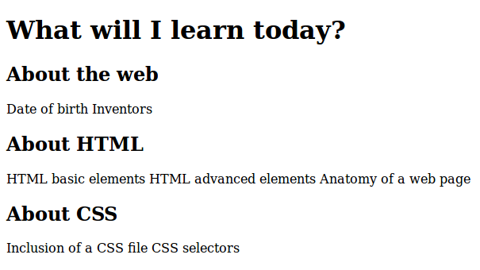
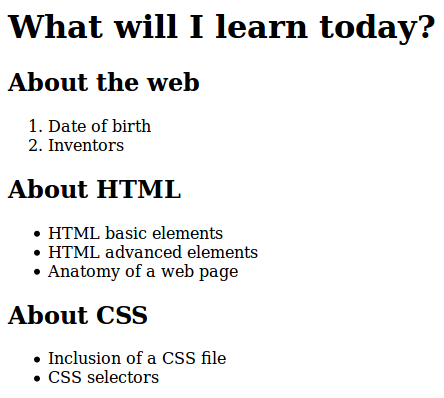

.. include:: ../commondefs.rst

===========================
Part 2 - More HTML elements
===========================

Nested elements
===============

HTML elements can be **nested** (elements can contain other elements).

Example:

.. code-block:: html

   <em> This is a <strong>very important</strong> paragraph.</em>

And this is the result:

.. raw:: html

   <em> This is a <strong>very important</strong> paragraph.</em>

Nested elements: be careful!
============================
       
However, be careful when you include an element in another.

For example, this is not correct: 

.. code-block:: html

   <em> This is a <strong>very important</em> paragraph.</strong>

.. raw:: html

   <em> This is a <strong>very important</em> paragraph.</strong>
                
When incorrectly nested, Weird behavior and unexpected errors can occur!

Headings
========

We have already seen the :html:`h1` element to define a title (headings).

You can have several levels of headings in your document: use :html:`h2` for second level, :html:`h3` for third level and so on.

Open :filename:`page3.html` and edit the document to include headings.

- "What will I learn today?" should be a level 1 headings.
- "About the web", "About HTML", and "About CSS" should be level 2 headings.

On the slide, you will see the expected result. 

Headings - expected result
==========================

       

Lists 
=====

HTML defines two types of lists: ordered lists (**ol**), and unordered lists (**ul**).

In both, a list item is identified by the **li** element.

Let's see some examples.

Ordered list
============

.. code-block:: html

   <ol>
     <li>Code</li>
     <li>Test</li>
     <li>Be proud!</li>
   </ol>

.. raw:: html

   <ol>
     <li>Code</li>
     <li>Test</li>
     <li>Be proud!</li>
   </ol>

Unordered list
==============

.. code-block:: html

   <ul>
     <li>HTML</li>
     <li>CSS</li>
     <li>JS</li>
   </ul>

.. raw:: html

   <ul>
     <li>HTML</li>
     <li>CSS</li>
     <li>JS</li>
   </ul>

Make your own lists
===================

Open :filename:`page3.html` and use the elements you've just discovered to add lists.

The text is already written for you.

The expected result is shown just after. 

Make your own lists - expected result
=====================================

       
If you have time, add a link from this page to :filename:`page2.html`, and from :filename:`page2.html` to this page!

Summary and a piece of advice
=============================

- Make sure your elements are correctly nested!

- (Nearly) all elements must be closed (except in some very rare cases such as img).

- Piece of advice: have you tried :shortcut:`F12` on your web browser? It is sometimes helpful... especially when you have a bug!

