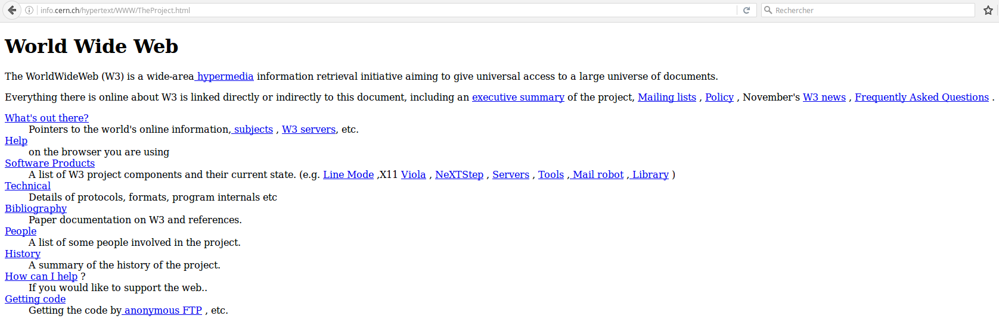

===============
Before we start
===============

What is internet?
=================

Internet is a network of connected devices. 

.. figure:: _static/internet.png
    :width: 80%
    :align: center
    :alt: The web.
    :figclass: align-center

What is the Web?
================

The web is **only** a service of internet.

.. figure:: _static/web.png
    :width: 80%
    :align: center
    :alt: The web.
    :figclass: align-center

The first web page?
===================

      
Want to learn more about it?

http://info.cern.ch/hypertext/WWW/TheProject.html

Who created the first web page?
===============================

Sir Tim Berners Lee dit it!

What's behind the scene?
========================

This is an overview of the HTML code of THIS page. Don't be afraid, you will learn to write this today!

Role of the web browser
=======================

Remember: the web browser (Firefox, Chrome, Opera, Safari) is in charge of reading the HTML source code and to translate it in beautiful web pages easy to read for you!

